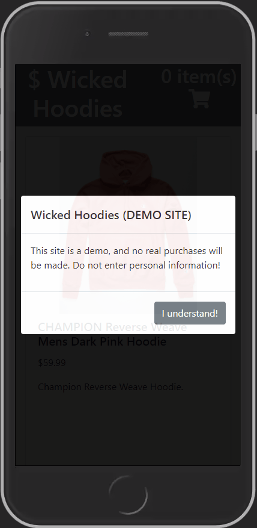

# Wicked Hoodies
Wicked Hoodies is a full stack shopping cart app created with Node.js and React.

## Technologies Used
- React.js
- Node.js
- Express.js
- PostgreSQL
- HTML5
- CSS3
- Babel
- AWS EC2
- Webpack
- Bootstrap

## Features
- User can view products for sale
- User can view the details of a product
- User can add a product to their cart
- User can view their cart summary
- User can checkout

## Live Demo

Try the app at [Wicked Hoodies](https://wicked-hoodies.kevinnhim.com)


## Preview


## Development

### System Requirements
- Node.js 10 or higher
- npm 6 or higher
- PostgreSQL

### Getting Started

1. Clone the repository:

```shell
git clone https://github.com/knhim/wicked-hoodies.git
cd wicked-hoodies
```

2. Install dependencies with NPM:
```shell
npm install
```

3. Start PostgreSQL (in Linux):
```shell
sudo service postgresql start
```
4. Create the database:
```shell
createdb wickedHoodies
```

5. Copy the .env.example file and update with your PostgreSQL credentials
```shell
cp .env.example .env
```

6. Import the example database to PostgreSQL:
```shell
npm run db: import
```

7. Start the app:
```shell
npm run dev
```

8. View application locally:
```shell
http://localhost:3000
```
